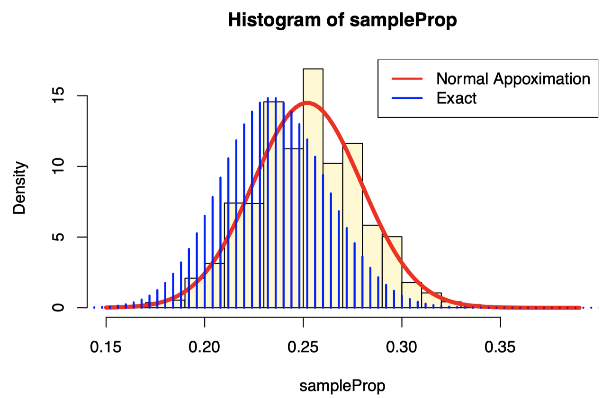

<!-- <link rel="stylesheet" href="styles.css" type="text/css"> -->

```{r include = F, message=F, warning=F}
library(dplyr)
```

<br><br><br>

[< Back to Syllabus](toc.html)

<br><br><br>


### 1. Bootstrap

#### 1.1 Motivation

+ We make some assumptions that:
    + we knew the **data generating distribution**, or
    + we had enough observations to use **asymptotic approximations**.
    
+ In other words, for a sample proportion, we know that the exact sampling distribution is a **rescaled binomial distribution**.
    + If $Y~B(n, \pi)$ then the sample proportion is $Y/n$, so it is a rescaled binomial.
    + If $n$, $np$, and $n(1-p)$ are large enough, then the sample proportion can be approximated with a **normal distribution**:

$$
\mathrm{N}\left(\pi, \sqrt{\frac{\pi(1-\pi)}{n}}\right)
$$

+ What if we don't want to make assumptions on the data generating distribution or we don't want to rely on asymptotic results?
    + We can use **bootstrap** to approximate the sampling distribution of the estimator.

<br>

#### 1.2 Definition of the bootstrap
+ **Bootstrap** is a procedure that uses the given sample to create a new distribution that approximates the sampling distribution of a given statistics.
    + The new distribution is called the **bootstrap distribution**.
+ **Bootstrap distribution** can be obtained by:
    + <1> drawing samples of size $n$ **with replacement** from the original sample
    + <2> and then comput the statistic for each sample.
        + These samples are called **resamples** or **bootstrap samples**.

<br>

#### 1.3 The bootstrap procedure
+ Given a sample of $n$ observations (the original sample):
    + <1> Draw a sample of size $n$ which replacement from the original sample.
    + <2> Compute the value of the statistic for each bootstrap sample.
    + <3> Repeat the process for $B$ times (with $B$ 'large').
    + <4> Construct the bootstrap distribution of the statistics.
    
<br><br>

### 2. Example: Proportion of Manhattan residents under the age of 25 years
Recall an example used in class. The US Census indicates that 35% of US residents are less than 25 years old. We will take a random sample 120 of Manhattan residents and determine the proportion of individuals who are less than 25 years old. The question of interest is whether there is there evidence that Manhattan has a different age distribution than US residents globally.

We will simulate a random sample from Manhattan. In our sample, we will indicate a "success" (person under 25 years old) as an 1 and a 0 will represent an individual who is 25 years or older. The code below saves the sample results in an vector called `manhattanSamp`. Here is code for a random sample of size 250.

<br>

#### 2.1 What is the (sampling) distribution of $P$, the sample proportion?

```{r eval = F}
B <- 10000
n <- length(manhattanSamp)
sampleProp <- replicate(B, {
    x <- sample(manhattanSamp, size = n, replace = TRUE)
    mean(x)
})

hist(sampleProp, probability = TRUE, breaks=30, col="lemonchiffon") 
curve(dnorm(x, mean = mean(manhattanSamp), sd = sd(manhattanSamp)/sqrt(n)), add=TRUE, col=2, lwd=4) 
lines((0:250)/250,250*dbinom(0:250,250, 0.235), type="h", lwd=2, col=4) 
legend("topright", c("Normal Appoximation", "Exact"), lty=1, col=c(2,4), lwd=2)
```

```{r echo = F}
set.seed(5)
manhattanSamp <- rnorm(250, 0.25, 0.45)
B <- 10000
n <- length(manhattanSamp)
sampleProp <- replicate(B, {
    x <- sample(manhattanSamp, size = n, replace = TRUE)
    mean(x)
})
```


```{r fig.align='center', fig.width=6, fig.height=4, echo=FALSE}

```


+ In both the mean and the standard deviation, we can see that the bootstrap sample has value similar to the original sample.

<br>

#### 2.2 Bootstrap quantiles: Percentile Method

+ Since the bootstrap allows us to approximate the whole sampling distribution of the estimator, we can also compute the quantiles to construct a confidence interval for the mean.
+ `R`:

```{r}
quantile(sampleProp, c(0.025, 0.975))
```

+ This is called the **percentile method**.
+ According to the percentile method, the 95% confidence interval is `r as.vector(quantile(sampleProp, c(0.025, 0.975))[1])` to `r as.vector(quantile(sampleProp, c(0.025, 0.975))[2])`.

<br><br>

### 3. Properties of the bootstrap distribution

#### 3.1 Center of the bootstrap distribution

+ The center of the bootstrap distribution is **NOT** an accurate approximation of the center of the sampling distribution.
    + The bootstrap distribution of $\hat{\theta}$ is centered around the observed value $\hat{\theta}$ not around $\theta$.
+ Hence, the bootstrap procedure cannot be used to get better parameter estimates.

<br>

#### 3.2 Variance and bias

The variance of the bootstrap distribution is a good approximation of the variance of the sampling distribution.

+ The bias of the bootstrap estimates reflect the bias of the estimator.
+ **The bootstrap is a procedure that can be used to qunatify the performance of estimators.**
+ Bootstrap을 통해서 estimators(모수추정치들)의 성능(얼마나 좋은/정확한 추정인지)을 평가할 수 있음

<br>

#### 3.3 Example: Computing the MSE of an estimator
+ The Mean Squared Error (MSE) of an estimator is:

$$
M S E[\hat{\theta}]=E\left[(\hat{\theta}-\theta)^{2}\right]=\operatorname{Var}(\hat{\theta})+\operatorname{Bias}(\hat{\theta})^{2}
$$

+ We can use the bootstrap to estimate the MSE by substituting the original estimate $\hat{\theta}$ for $\theta$ and the bootstrap estimates $\hat{\theta}*$ for $\hat{\theta}$.

$$
\widehat{M S E}[\hat{\theta}]=\frac{1}{B} \sum_{b=1}^{B}\left(\hat{\theta}^{*}-\hat{\theta}\right)^{2}=\operatorname{Var}\left(\hat{\theta}^{*}\right)+\operatorname{Bias}\left(\hat{\theta}^{*}\right)^{2}
$$

+ `R` to compute an estimate of the MSE for a bootstrap sample proportion.
```{r}
# MSE
sum((sampleProp - mean(manhattanSamp))^2)/B
```

> The estimate of the MSE for a bootstrap sample proportion is `r sum((sampleProp - mean(manhattanSamp))^2)/B`.
> So an estimate of the MSE for a bootstrap sample proportion is 0.001. The corresponding bias of the bootstrap estimator (to three decimal places) is 0.

<br>

#### 3.4 Asymptotic vs Bootstrap confidence interval

+ For estimating a population proportion, we have seen two ways.
    + <1> the normal distribution is a good approximation of the sampling distribution of $P$ when $n$, $n \pi$, $n(1-\pi)$ is large
    + <2> bootstrapping
+ Note that **both are approximations**!
    + There is no fixed rule to choose between the two methods, but rather one needs to know the situations in which one works better than the other.
        + (symmetric, unimodal distribution) the normal approximation works better than the bootstrap.
        + (asymmetric, bimodal distribution) the bootstrap may be a better alternative than the normal approximation.
    + When $n$ is small, both methods do not work well.
        + When $n$ is small, use the **exact rescaled binomial distribution**.

<br><br>

### 4. Accuracy of the Bootstrap

#### 4.1 Random sampling
+ The bootstrap principle involves drawing n observations from the original sample with replacement.
+ In small samples, we could create all possible resamplings, but even for moderate $n$, this is unfeasible.
+ For $n$ = 10 and $n$ = 20 the number of possible samples are:

```{r}
n <- 10
(ps <- choose(2 * n -1, n))
```

> In case of $n$=10, there are `r ps` possible samples.

```{r}
n <- 20
(ps <- choose(2 * n -1, n))
```

> In case of $n$=10, there are `r ps` possible samples.

<br>

+ Hence, we usually randomly select a **subset B of such resamplings**.
+ This means we have **two distrinct distributions**:
    + **Theoretical bootstrap distribution** consisting of all the $n^n$ values.
    + **Monte Carlo bootstrap distribution** consisting of the randomly selected $B$ < $n^n$ values.
        + **Monte Carlo bootstrap sampling** adds **additional unwanted variability**, that depends on how large B is.

<br>

#### 4.2 Accuracy of bootstrap distributions
+ <1> How accurate is the theoretical bootstrap?
+ <2> How accurately does the Monte Carlo implementation approximate the theoretical bootstrap?

<br>

+ Can improve the accuracy in <2> by **increasing the number of bootstrap samples**.
+ However, there are situations in which the theoretical bootstrap distribution is **NOT** accurate.

<br>

#### 4.3 Sample proportion: large sample size
+ In case for which we know the sampling distribution of the population proportion,
    + Consider $Y$~$B(n, \pi)$, then
    + we know that the sample proportion, $P$, is a rescaled binomial with mena $\pi$.
+ `R`: How the bootstrap distribution approximates the true distribution with a large sample size, $n$=300 and a population proportion of $\pi$=0.5.

```{r}
n <- 300
# Using the same original sample
y <- rbinom(300, 1, 0.5)
B <- 10000
boot <- replicate(B, {
    s <- sample(y, size = n, replace = TRUE)
    # Using the original sample
    mean(s)
})

plot((0:300)/300,300*dbinom(0:300,300, 0.5), type="h", col = 2, lwd=4, xlab="sample proportion", ylab="density")
lines(density(boot), col=4, lwd=4)
abline(v = 0.5, lwd = 2, col = 1, lty = 2)
abline(v = mean(y), lwd = 2, lty = 2, col=5)
legend("topright", c("True mean", "Sample mean"), lty=2, col=c(1,5), lwd=2)
```

+ The bootstrap distribution is not an accurate approximation of the center of the distribution.
+ However, it is accurate at approximating its **spread**.
    + The spread (measured by the standard deviation) of the bootstrapped distribution is 0.029 and the corresponding value in the sample is 0.029.

<br>

#### 4.4 Sample mean: large sample size
+ <1> Using the original sample
    + the accuracy related to point 2 above is pretty good.
    
```{r}
n <- 300
# Using the original sample
y <- rbinom(250, 1, 0.5)
B <- 10000

boot <- replicate(10, {
    replicate(B, {
        s <- sample(y, size = n, replace = TRUE)
        # Using the original sample
        mean(s)
    })
})
```

+ The standard deviation of each of the 10 different bootstrap sampling distribution is :

```{r}
(sds <- apply(boot, 2, sd))
```

+ <2> With different samples for each bootstrap
    + the accuracy related to point 1 above is also pretty good.
    + However, the variability coming from the random sampling of the original sample is **much higher** than the bootstrp variability.

```{r}
n <- 300
B <- 10000

boot2 <- replicate(10, {
    # With different samples for each bootstrap
    y <- rbinom(n, 1, 0.5)
    replicate(B, {
        s <- sample(y, size = n, replace = TRUE)
        mean(s)
    })
})
```

+ And the standard deviations of each of the 10 bootstrapped samples are:

```{r}
(sds2 <- apply(boot2, 2, sd))
```

+ The ratio of the variances: **0.957**
    + (Variance of the 10 standard deviations of the bootstrapped samples from the same original sample) vs.
    + (Variance of the standard deviations of bootstrapped samples each from a different original sample)
+ 0.957 which is less than one, it shows that the **variability in each sample is more than that of the bootstrapped sample from the original sample.**

<br>

#### 4.5 Sample mean: samll sample size

+ In case $n$=5,

```{r}
n <- 5
y <- rbinom(n, 1, 0.5)
B <- 10000

boot <- replicate(B, {
    s <- sample(y, size = n, replace = TRUE)
    mean(s)
})

plot((0:5)/5,5*dbinom(0:5,5, 0.5), type="h", col = 2, lwd=4, ylim = c(0, 2), xlab="sample proportion", ylab="density")
lines(density(boot, bw=.1), col=4, lwd=4)
abline(v = 0.5, lwd = 2, col = 1, lty = 2)
abline(v = mean(y), lwd = 2, lty = 2, col=5)
legend("topright", c("True mean", "Sample mean"), lty=2, col=c(1,5), lwd=2)
```

+ With small $n$, the bootstrap distribution is not an accurate approximation of the spread of the sampling distribution.
    + The standard deviation of the bootstrap sampling distribution is 0.221, while the standard deviation from the original sample is 0.245.
    + But the accuracy is not bad.

<br>

+ In case $n$=10,

```{r}
n <- 5
y <- rbinom(5, 1, 0.5)
B <- 10000

boot <- replicate(10, {
    replicate(B, {
        s <- sample(y, size = n, replace = TRUE)
        mean(s)
    })
})

(sds <- apply(boot, 2, sd))
```

+ If we repeat the procedure with different original samples, we see that the accuracy related to point 1 above is now worse.

> **Takeaway**
>
> + The accuracy of the theoretical bootstrap depends on the original sample size n, while the accuracy of the Monte Carlo procedure depends on the number of bootstrap samples B.

+ `R`: 10 bootstrapped sampling distributions, each from a different original sample

```{r}
n <- 5
B <- 10000

boot2 <- replicate(10, {
    y <- rbinom(n, 1, 0.5)
    replicate(B, {
        s <- sample(y, size = n, replace = TRUE)
        mean(s)
    })
})
```

+ The ratio of the variances: **0.018**
    + (Variance of the 10 standard deviations of the bootstrapped samples from the same original sample) vs.
    + (Variance of the standard deviations of bootstrapped samples each from a different original sample)
+ 0.018 which is less than one, it shows that the **variability in each sample is more than that of the bootstrapped sample from the original sample.**

<br>

#### 4.6 How many bootstrap samples are needed?
+ In general, $B=10000$ bootstrap samples lead to good accuracy
    + but there may be reasons to draw more or less samples, depending on the problem and on the objective of the study.
+ Most of the time, **the main limiting facotr is the size of the original sample**, not the number of bootstrap samples.

<br>

+ In case $B$=100,
```{r}
n <- 250
y <- rbinom(n, 1, 0.5)
B <- 100

boot <- replicate(10, {
    replicate(B, {
        s <- sample(y, size = n, replace = TRUE)
        mean(s)
    })
})

(sds <- apply(boot, 2, sd))
```

<br><br>

### 5. Useful `R` packages
+ `boot` package is a gneral purpose package for all different types of the bootstrap
+ `slipper` package is designed to work with the bootstrap in a `tidyverse` pipeline

#### 5.1 `boot` package
+ reuqires three arguments:
    + the original sample
    + a function to compute the statistics
    + number of bootstrap samples

```{r}
library(boot)
n <- 300
x <- rbinom(n, 1, 0.5)

bootProp <- function(x, idx)
    {
    return(c(mean(x[idx]), var(x[idx])))
}

(bootObj <- boot(x, bootProp, 10000))
```

+ Confidence interval:

```{r}
boot.ci(bootObj, type = 'all')
```

<br>

#### 5.2 Example
The question is whether the there is evidence that the age distribution of Manhattan residents differs from that of the general US residents. We know that the $\pi$=0.35 for US residents. The manhattanSamp contains a random sample of Manhattan residents (it is truly a realistic representation of the Manhattan residents). We will now use boot to generate a percentile confidence interval for the population proportion based on a bootstrapped distribution of our sample.

```{r warning=FALSE, message=FALSE}
bootProp <- function(x, idx) {
    return(mean(x[idx]))
}

bootManhattanObj <- boot(manhattanSamp, bootProp, 10000)
boot.ci(bootManhattanObj, type = 'all')
```


> + The 95% confidence interval is `r round(boot.ci(bootManhattanObj, type = 'all')$normal[2], 3)` to `r round(boot.ci(bootManhattanObj, type = 'all')$normal[3], 3)`.
> + Since the 95% bootstrap confidence interval does not contain 0.35, there is evidence that the age distribution of Manhattan residents differs from the general population of US residents.
> + It appears as though there is a lower proportion of Manhattan residents who are under 25 years old.


<br><br><br>

[< Back to Syllabus](toc.html)

<br><br><br>
