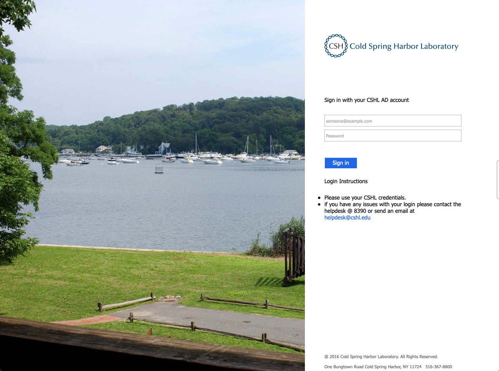
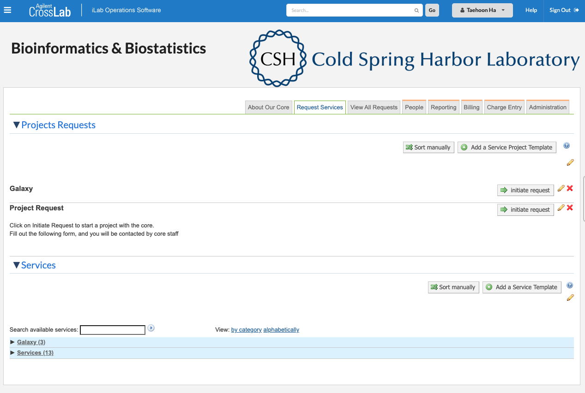
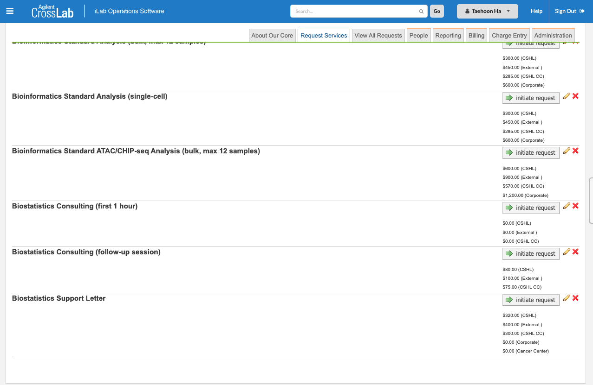

```{r setup, include=FALSE}
knitr::opts_chunk$set(echo = F)
library(tidyverse)
library(flextable)
```

<br><br>

### Notice 

Due to the Core Facilities policy change as of 9/1/2022, biostatistics consulting requests should be registered on iLab and charged per hour basis. Please feel free to reach me out via [ha@cshl.edu](mailto:ha@cshl.edu) if you are confused about this process. We can figure it out together. For more details on this policy change, please contact [Denise Robert](mailto:robertsd@cshl.edu).

<br><br><br>

### 1. Please go to [CSHL iLab webpage](https://cshl.ilabsolutions.com/account/login) and sign in.

+ Webpage link: [https://cshl.ilabsolutions.com/account/login](https://cshl.ilabsolutions.com/account/login)

```{r}

```

<br><br><br>

### 2. After your sign-in, please go to Bioinformatics & Biostatistics Core. Click **Services(13)** at the bottom.

```{r}

```

### 3. Out of 13 services, Please click the relevant service(s) you need. For biostatistics, there are 3 service types and they were located at the bottom of the list.

- **Biostatistics Consulting (first 1 hour)**: This is biostatistics office hours. It is one-hour complimentary statistical advice only for the CSHL Cancer Center faculty, staff, and students. Please arrange an appointment with Taehoon Ha, Biostatistician [here](https://calendly.com/cshlbiostat/officehours).

- **Biostatistics Consulting (follow-up session)**: After the initial meeting, you can submit additional requests (e.g., data analysis). Approximate estimate will be provided beforehand. Upon agreements between both parties, the biostatistics consulting services will be provided.

- **Biostatistics Support Letter**: This typically includes a biostatistician's biosketch, biostatisticis support letter, and power calculations for grant applications.

```{r}

```


